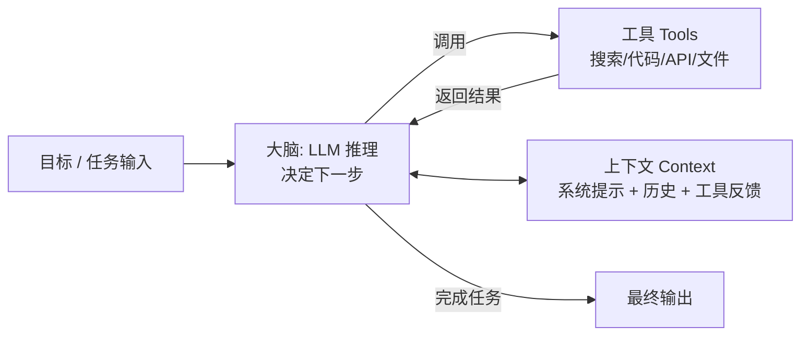

# Agent（AI 智能体）

## 0. 元信息

- **概念名称**：Agent（AI Agent / 智能体，含 AI Agent / autonomous agent / agentic 工作流）
- **语境领域**：大语言模型应用 / 生成式 AI 工程
- **一句话定位**：让大模型在"目标"驱动下**自主决定怎么做、调用工具、分步执行直到任务完成**的系统
- **假设**：本文谈的是 LLM 驱动的软件 Agent（如 Claude Code、各类 coding agent 的底层范式），不讨论强化学习领域的传统智能体定义。

---

## 1. 概念的个人解释

**一句话定义**：Agent 是一个由大模型"当大脑"的程序——你只给它一个目标和一把工具，它自己规划步骤、自己判断下一步、调用工具拿结果、再把结果放回"思考"里，如此循环直到完成。

**类比**：把模型当成一名**新入职员工**。
- 普通调用（无 Agent）= 你给员工一句指令："把这个 PDF 第 3 页的表填了。"员工只动嘴，做完一句就停。
- Workflow（预编排）= 你写好 SOP："第一步读文件、第二步提取字段、第三步填表"，员工照着跑。
- Agent = 你说："把客户这份申请表核对并归档。"员工自己拆任务、遇到问题自己决定用哪个系统查、查完自己接着干，你只验收结果。

**"它到底解决什么问题"**：传统程序把"逻辑"写死，模型调用只能完成单轮问答；真实任务往往是**开放式的**（需求模糊、步骤不定、中途有意外），需要"能连续行动的程序"。Agent 把模型的推理能力和外部世界的执行能力（文件、API、浏览器、代码运行）接起来，把"会不会做"变成"能不能自己做完"。

**我的直觉判断**：Agent 的本质不是"更聪明的模型"，而是一个**把推理放进循环（reasoning in the loop）的架构**——质量来自"模型 + 上下文 + 工具 + 循环"四者的配合，缺一个都会露馅。

---

## 2. 核心机制或组成

Anthropic 在《Building effective agents》中给出了一个被广泛引用的分法：把「模型直接生成」→「工作流 Workflow」→「Agent」看成一个由"人控制程度递减、模型自主程度递增"的光谱。Agent 处于自主端。

一个典型的 Agent 系统由四部分构成：

| 组成 | 作用 | 常见形态 |
| --- | --- | --- |
| 大脑（推理循环） | 拆解任务、决定下一步动作、判断是否完成 | LLM + ReAct / 规划类提示框架 |
| 工具（工具调用） | 让 Agent 能对外部世界"动手"，而不只是动嘴 | Function calling、MCP 服务器、代码解释器、浏览器、文件系统 |
| 上下文 | Agent 做判断的全部依据：任务、规则、历史、工具返回 | System prompt、多轮消息、检索结果（见 `context.md`） |
| 记忆 | 跨轮/跨会话保留有用信息 | 对话历史、KV 缓存、外部 memory store（长短期记忆） |

**几种常见"套路"（design patterns，来自 Building effective agents）**：

- **Prompt chaining**：固定顺序，上一步输出是下一步输入——适合流水线任务，每步可单独检查；
- **Routing**：先分类，再分发到不同专门流程/提示——如客服先判"售后/售前/退换"；
- **Parallelization**：多路同时干，汇总结果——适合可切分、相互独立的工作；
- **Orchestrator-workers**：一个"主编"Agent 把大任务拆给多个"写手"子任务并整合；
- **Evaluator-optimizer**：一个生成、一个评审，循环打磨——适合写作/代码这类可迭代质量的任务；
- **Autonomous agent**：端到端自主执行，循环直到完成。

> 设计原则：**能用简单方案就不要上 Agent**。Anthropic 的明确建议是——只有当"需要动态决策、任务规模/复杂度不可预知"时才用 Agent，越简单越要选 workflow，因为 workflow 更可预测、更省成本。

---

## 3. 一个具体应用场景

**场景：一个"订单异常处理客服 Agent"**（替代原先"固定规则脚本 + 人工兜底"）

**背景**：某电商客服系统每天有大量订单异常工单（超时未发货、地址不完整、支付状态不一致）。以前是写死 if-else 规则去匹配，覆盖不全；每单都转人工又太贵。

**怎么做**：
1. 给 Agent 一把工具集：`查询订单`、`查询库存`、`修改订单状态`、`发送通知邮件`（通过 MCP 或 Function calling 暴露）；
2. 给它一个高质量的 system prompt（上下文工程），写明：客户利益优先、金额超 500 元必须转人工、回复要礼貌且附单号；
3. 每次工单进来，把订单信息、客户历史、售后政策**检索后注入上下文**，而不是塞全部库；
4. Agent 自主循环：读工单 → 判断类型 → 查订单 → 决定"自动处理 or 转人工" → 执行 → 汇报结果。

**为什么这样有效**：异常类型组合几乎无限，规则脚本写不全；Agent 用模型推理覆盖开放情况，同时用**工具**保证"改状态/发邮件"是真实执行而非模型瞎编；用**上下文控制**保证安全边界（超阈值转人工）被遵守。这就是"推理 + 工具 + 上下文"三件套的合力。

---

## 4. 容易混淆的问题 / 使用边界

1. **Agent ≠ 更聪明的模型**
   Agent 的价值在架构（循环 + 工具 + 上下文），不在模型智商。给一个平庸模型套上 Agent，只是让它更快地犯错误。
2. **Agent ≠ 一次性"AutoGPT 式"的全自动梦想**
   端到端全自主在多数生产场景仍不可靠。成熟做法往往退一步：用 **workflow + 受控的 agent 循环 + 人在关键节点审批**（human-in-the-loop）。"自主"是分级的，不是二元的。
3. **Agent 不是"不会犯错"的执行器**
   模型会**高估自己的能力**（hallucinated capability）：以为调用了工具、以为写入了数据库。必须靠工具的真实返回、日志、断言和人类抽检来兜底，而不是默认它成功。
4. **不要为确定性任务上 Agent**
   固定输入、固定规则、可穷举分支的任务，用 workflow/普通程序更便宜、更快、更可预测。Agent 的"灵活"在简单任务上只是"不稳定"的另一种说法。
5. **上下文上限是 Agent 的实际天花板**
   Agent 能"记得"多少、判断多准，直接受上下文窗口和上下文质量限制（详见 `context.md`）。任务越长越复杂，上下文污染和"记不住前面的结论"会显著拉低表现。

---

## 5. 资料来源（可核查）

| # | 来源（机构 / 标题） | URL | 引用内容 | 核验 |
| --- | --- | --- | --- | --- |
| 1 | Anthropic 工程博客：《Building effective agents》 | https://www.anthropic.com/research/building-effective-agents | §2 的 workflow/agent 光谱、六种 design patterns、何时用 agent | 200，2026-09-04 |
| 2 | Anthropic 工程博客：《Effective context engineering for AI agents》 | https://www.anthropic.com/engineering/effective-context-engineering-for-ai-agents | Agent 与上下文的配合（§1/§4 依据） | 200，2026-09-04 |
| 3 | Anthropic 工程博客：《Equipping agents for the real world with Agent Skills》 | https://www.anthropic.com/engineering/equipping-agents-for-the-real-world-with-agent-skills | 用 Skill 为 Agent 注入专项能力（相关概念参照） | 200，2026-09-04 |
| 4 | LangChain 官方文档：《Agents concepts》 | https://python.langchain.com/docs/concepts/agents/ | Agent 工程化框架视角（工具/记忆实现） | 308（重定向至有效页），2026-09-04 |

**链接核验记录**：上述链接于 **2026-09-04** 逐一验证；#1–#3 返回 200（可直接访问）；#4 返回 308 永久重定向（LangChain 文档迁移所致，浏览器打开即自动跳转到有效页面），内容仍有效。

> 提示：资料内容属技术常识整理，观点性判断（如"该不该用 Agent"）以 Anthropic 原文为准。
