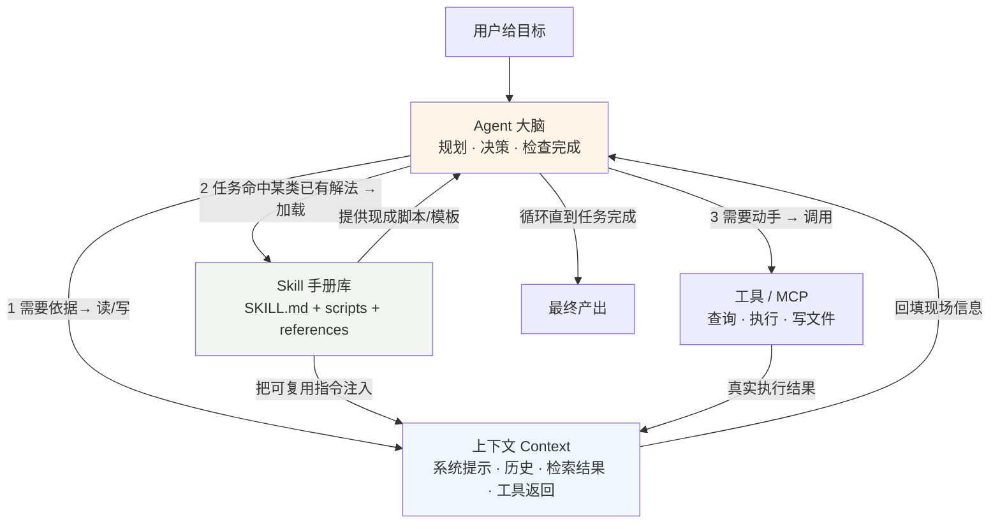

# Agent × 上下文 × Skill：三个概念的关系说明

> 配套资料：`learning-materials/agent.md`、`learning-materials/context.md`、`learning-materials/skill.md`

## 一句话核心关系

**Agent 是"干活的人"，上下文是它此刻"桌上的案卷"，Skill 是它"随身携带的专业手册库"**——Agent 在行动循环中不断读写上下文；当任务命中某类"已有解法"时，Agent 就把对应的 Skill 加载进上下文照着做。三者是 **执行主体 / 瞬时输入 / 沉淀知识** 的关系。

---

## 1. 总览表

| 维度 | Agent | 上下文（Context） | Skill |
| --- | --- | --- | --- |
| 一句话定位 | 自主决定"做什么、下一步怎么走"的执行主体 | 本次任务中模型"能看到/能依据"的全部输入 | 把一类任务的程序性知识打包成可复用、按需加载的文件 |
| 回答的问题 | "我要完成什么、分几步、何时停" | "我现在掌握哪些事实和规则" | "这类事以往是怎么做对的" |
| 时间属性 | 过程（一个任务的完整生命周期） | 瞬时（每次推理的现场输入） | 持久（跨会话、跨项目沉淀的资产） |
| 存储位置 | 运行时编排（循环逻辑） | 请求里的 token / 缓存 | 文件系统（目录 + SKILL.md + 资源） |
| 在本体系中的角色 | 执行主体 / 大脑+手脚 | 燃料与边界 | 方法库 / 可复用上下文 |
| 无它会怎样 | 只剩"单轮问答或写死流程" | 模型只能靠训练时的旧知识硬答 | 每次都要从零教，知识无法积累 |

---

## 2. 三者如何协作：一个完整画面

阅读顺序（数字为每轮循环的典型动作）：
1. Agent 读上下文获得"现场情况"（用户需求、已有规则、刚查到的数据）；
2. 若判断"这属于某类已有标准做法"，则把对应 **Skill 的指令加载进上下文**、必要时跑它的脚本；
3. 需要外部能力时调用**工具/MCP**，把真实结果写回上下文，供下一轮推理使用；
4. 如此循环，直到 Agent 自评任务完成，输出结果。

> 图中的"工具/MCP"不在本次三个概念之内，但它是理解 Agent 闭环的邻居，故一并标出以作区分。

---

## 3. 重点一：上下文如何影响 Agent 的工作

**上下文是 Agent 每次决策的唯一依据，因此也是 Agent 质量的天花板。** 影响体现在四个方面：

| 影响面 | 机制 | 上下文没给好时的后果 |
| --- | --- | --- |
| 任务理解 | 系统提示 + 本轮历史定义了"目标、约束、边界" | Agent 跑偏方向、踩红线（如越权操作） |
| 事实准确性 | 检索/工具结果注入的是"新鲜事实"，模型训练知识可能过时 | 一本正经地编造（幻觉） |
| 决策连续性 | 多轮循环中关键中间结论靠上下文携带 | "做了上一步忘了下一步"，长任务前后矛盾 |
| 成本与速度 | 每轮发送的 token = 上下文长度 | 塞满无关内容 → 慢、贵，且关键信息被淹没（lost in the middle） |

**工程含义**：让 Agent "变聪明"的两个最廉价杠杆，恰恰都在上下文一侧——**给它正确的现场信息（检索/工具注入），并给它正确的做事规范（系统提示/Skill）**。上下文工程（决定放什么、怎么组织、放多少）本质上就是"Agent 治理"：上下文写清了安全边界，Agent 才谈得上可控；上下文塞了脏数据，Agent 再强也救不回来。

> 细节与最佳实践见 `context.md` §2、§3。

---

## 4. 重点二：Skill 如何沉淀可复用的任务知识

**Skill 本质上是"被结构化的、可复用的上下文"**——把那些每次都要口头叮嘱 Agent 的做事步骤，固化成一个可发现、可加载、可版本管理的文件包。

沉淀的四个环节：

1. **显性化**：把"做对这类事的经验"写成 `SKILL.md` 指令（步骤、红线、验收标准），脱离某一次具体对话而独立存在；
2. **元数据化**：用 YAML frontmatter 的 `name` + `description` 给它"门牌号"，让 Agent 能在**启动时**只凭一句话描述就判断"何时该用它"——这是可被自动发现的前提；
3. **模块化**：指令（SKILL.md）与知识细节（references/）、工具（scripts/）分层存放，通过**渐进式披露**只把当前需要的部分加载进上下文，实现"装得多、占用少"；
4. **版本化与共享**：Skill 是普通文件，可放进 Git、可跨项目/跨人复制，经验从"存在某个 AI 会话里"升级为"存在团队仓库里"。

于是沉淀带来三个可复用收益：
- **跨会话复用**：下次任何会话遇到同类任务，无需重新教导，Agent 自动调用同一套标准做法，输出质量稳定；
- **跨 Agent 复用**：同一格式（Agent Skills 开放标准）被多款产品支持，一份知识"写一次、到处跑"；
- **跨团队复用**：新手（哪怕是另一个 AI 实例）拿到仓库即可继承"老手"的经验，形成组织记忆。

**Skill 与"一次性提示词"的本质差别**就在于这四点——一次性提示词没有身份标识（无法被自动发现）、不附带资源、不参与版本管理，用一次就消散；Skill 则是**可寻址的知识资产**。

> 结构与规范细节见 `skill.md` §2、§3。

---

## 5. 一个把三者串起来的例子

以本仓库的 `concept-explainer` Skill 为例：

1. **Skill（沉淀层）**：作业要求"以后任何新概念都要按五段结构、附可核查来源"——这份要求被写成 `.workbuddy/skills/concept-explainer/SKILL.md`，成为仓库里可复用的方法论；
2. **Agent（执行层）**：当未来有人（或新的 AI 会话）说"学一下 RAG"，Agent 读到 Skill 的 description 后判断命中 → 加载执行步骤；
3. **上下文（输入层）**：Agent 在每份资料里注入当前任务现场——概念名、用户给的目标受众、实时核验到的资料来源链接。Skill 保证"**写法统一**"，上下文保证"**内容贴合当下**"。

缺了任何一环：没有 Skill → 每次产出结构都不一样、无法积累；没有上下文 → 资料空泛、来源不可核查；没有 Agent → 没有人去"执行这份方法论"，Skill 只是死文件。

---

## 6. 边界提示（防止把三者混为一谈）

- **Skill 不会替 Agent 做决策**：它提供"怎么做对"的方法，但"这次该不该用、下一步做什么"仍是 Agent 在循环里用上下文判断的；
- **上下文不会被 Skill 永久占用**：Skill 加载后也只是一段"临时案卷"，会话结束即释放；想跨会话记住结论，需要另做记忆持久化；
- **三者的正确关系不是层级包含，而是协作**：可以画成"Agent 使用上下文，也使用 Skill；Skill 通过上下文生效"，而不是"Agent 包含 Skill"或"Skill 包含上下文"。

---

## 7. 关联资料索引

| 文件 | 内容 |
| --- | --- |
| `learning-materials/agent.md` | Agent 的个人解释、机制、场景、边界、来源 |
| `learning-materials/context.md` | 上下文的个人解释、机制、场景、边界、来源 |
| `learning-materials/skill.md` | Skill 的个人解释、机制、场景、边界、来源 |
| `.workbuddy/skills/concept-explainer/SKILL.md` | 生成上述资料的方法论技能本身 |
