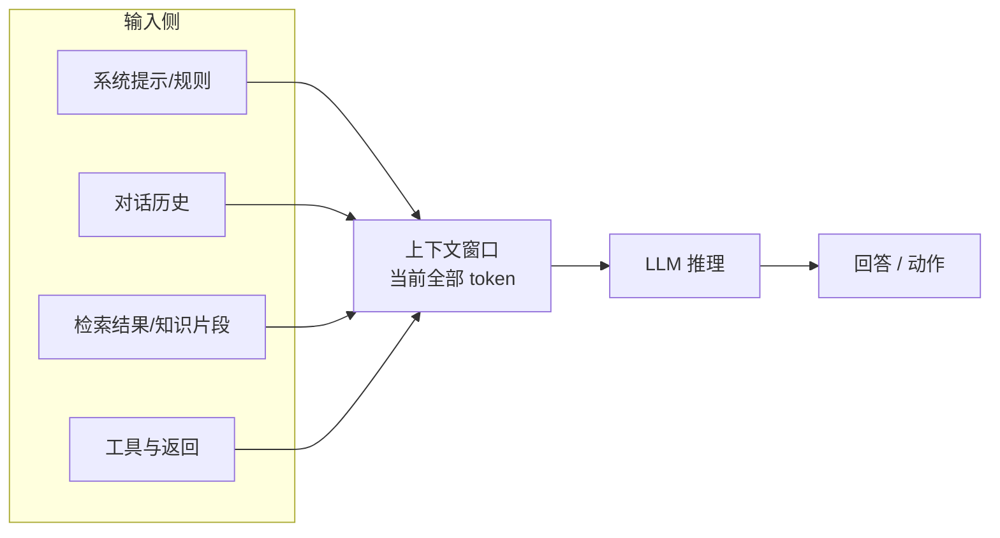

# 大模型的上下文（Context）

## 0. 元信息

- **概念名称**：上下文（Context / 上下文窗口 Context Window / 上下文工程 Context Engineering）
- **语境领域**：大语言模型（LLM）使用与工程化
- **一句话定位**：模型在**每一次生成前所能"看到"的全部输入信息**——它是模型判断的"临时大脑工作台"，决定输出质量的上限与下限
- **假设**：本文谈推理时输入给模型的上下文（对话、注入内容），不讨论 HTTP 协议等其它领域的"上下文"。

---

## 1. 概念的个人解释

**一句话定义**：把大模型想象成一个**只有工作台、没有长期档案的记忆天才**——每次你提问，它能依据的只有此刻放在它工作台上的那叠资料（上下文）；台上放什么、放多少、顺序如何，直接决定它这次答得有多靠谱。

**类比**：上下文 = **现场开庭的"案卷"**。
- 法官（模型）知识渊博（预训练），但**审案只能用提交上来的证据**，不能自己翻国家档案库（那是训练数据，不是现场案卷）。
- 律师（开发者的上下文工程）决定把哪些证据放进去、以什么顺序、删掉哪些无关的——案卷质量决定判决质量。
- 案卷太薄 → 证据不足乱判；案卷塞太满 → 关键证据淹没在废话里（"lost in the middle"，中间的容易丢）。

**"它到底解决什么问题"**：模型本身的知识在训练时已"冻结"，无法实时更新。要让它知道"你是谁、当前任务、刚查到的实时数据、公司的规范"，只能靠每次对话时把这些信息装进上下文。所以**工程上几乎所有质量问题，本质上都是上下文质量问题**：指令不清、缺背景、该检索的没检索、上下文被无关内容污染。

---

## 2. 核心机制或组成

**工作台有多大 = 上下文窗口（context window）**：模型单次能处理的最大 token 数（如几十万 token 的窗口）。它决定"能放进去多少"。

**工作台上有什么 = 上下文的组成**：

| 组成 | 例子 | 作用 |
| --- | --- | --- |
| System prompt（系统提示） | 角色设定、行为规则、输出格式、安全边界 | 稳定约束，几乎每轮都在 |
| 对话历史 | 用户之前的提问、模型之前的回答 | 多轮连贯，可被截断/压缩 |
| 检索注入的知识（RAG） | 从知识库/文档检索出的片段 | 补"训练后新知识"与私有知识 |
| 工具/函数定义 | Function 描述、MCP 工具清单 | 让模型知道"有什么可调" |
| 工具返回结果 | 查询到的订单、网页抓取内容 | 让模型基于真实数据作答 |
| Few-shot 示例 | 几个标准问答对 | 示范格式与风格 |

**上下文工程（Context Engineering）的三个关键杠杆**（出自 Anthropic《Effective context engineering for AI agents》）：

1. **放什么（retrieval）**：从外部资料里"挑"相关部分注入，而不是全量塞——决定相关性；
2. **怎么组织（organization）**：结构清晰、指令前置、区块分离（如 XML 标签），让模型容易"找到重点"；
3. **放多少（context optimization / 压缩）**：控制长度——截断、摘要、prompt caching 把历史压缩，避免窗口塞满或成本失控。

**为什么会"内容越多反而越差"**：模型注意力并非均匀——无关内容多时，模型会漏读关键信息（学界称 lost in the middle）；越靠中间的内容越容易被忽略。所以上下文质量 > 上下文长度。

---

## 3. 一个具体应用场景

**场景：企业客服 Agent 的"实时订单查询"回答**（说明"不塞库、现检索、注入上下文"的做法）

**背景**：客服模型被问"我的订单到哪了"。模型训练数据里没有用户的订单，硬答就会编造。正确做法是把真实数据**拿进上下文**再让它回答。

**怎么做**：
1. 系统提示写死规则："只能依据提供的订单信息回答，信息缺失就说明看不到，禁止猜测运输状态"；
2. 用户提问后，程序先解析出 `order_id`，调用订单 API 查实时物流，**只把这一单的 JSON 结果**注入到下一轮消息的工具结果位置；
3. 模型基于注入的上下文，组织成自然语言客服话术回复。

**为什么这样有效**：把"实时事实"装进上下文 → 模型不再凭空编造；只注入"这一单"而不注入全库 → 上下文小、成本低、准确高；规则写在系统提示 → 即便数据缺失也知道该说"查不到"而不是编。这正是上下文工程三杠杆（检索该检索的、组织好格式、控制好长度）的日常用法。

---

## 4. 容易混淆的问题 / 使用边界

1. **上下文 ≠ 模型的"记忆/知识"**
   上下文是**每次推理临时给的**，关掉窗口就没了（除非另做持久化记忆）；模型的长期知识来自预训练。把上下文当数据库存 → 每次重复花钱、窗口很快爆。
2. **上下文窗口大 ≠ 用得好**
   窗口能装 20 万 token，不等于 20 万 token 都有效。越长越容易丢失关键信息（lost in the middle）、延迟和成本越高。窗口上限是"油箱"，上下文工程才是"驾驶技术"。
3. **上下文工程 ≠ 提示工程（Prompt Engineering）的重复**
   提示工程通常指"把系统提示写得更巧"；上下文工程研究的是**整条输入通道**：检索什么、历史怎么管理、工具结果怎么回填。提示只是上下文的一部分。
4. **给太多 = 给太少一样有害**
   冗余上下文会稀释注意力，还可能引入互相矛盾的规则。上下文要"够用且克制"。
5. **安全边界**
   注入的第三方内容可能夹带**提示注入**（把"忽略以上指令"写进检索到的网页）；含敏感数据时要考虑脱敏与访问控制，不能盲目把私有数据塞进上下文发给模型。

---

## 5. 资料来源（可核查）

| # | 来源（机构 / 标题） | URL | 引用内容 | 核验 |
| --- | --- | --- | --- | --- |
| 1 | Anthropic 工程博客：《Effective context engineering for AI agents》 | https://www.anthropic.com/engineering/effective-context-engineering-for-ai-agents | §2 的三杠杆（检索/组织/优化）、Agent 上下文最佳实践 | 200，2026-09-04 |
| 2 | Anthropic 工程博客：《Building effective agents》 | https://www.anthropic.com/research/building-effective-agents | Agent 依赖上下文与工具的架构论述 | 200，2026-09-04 |
| 3 | OpenAI 官方文档：《Context engineering》 | https://platform.openai.com/docs/guides/context-engineering | 上下文工程官方指南（辅助参考） | 403，2026-09-04（被 Cloudflare 拦截，非链接失效；路径真实存在，可换网络/浏览器打开） |

**链接核验记录**：于 **2026-09-04** 验证。#1、#2 返回 200，可直接访问。#3 返回 403——OpenAI 站点对自动请求有防火墙（Cloudflare 拦截页），并非 404；该指南为 OpenAI 官方长期维护文档，建议在浏览器中人工打开确认内容。

> 提示：上下文工程是快速演进的领域，"长上下文与注意力缺陷"等结论以文中所引原始论文与官方文档的最新表述为准。
